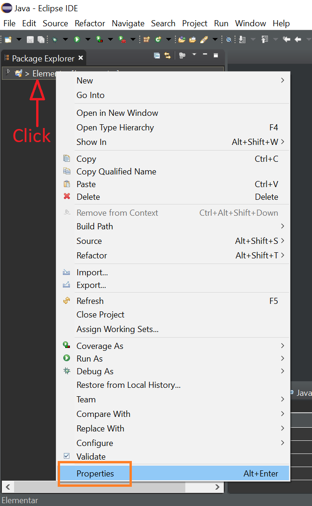
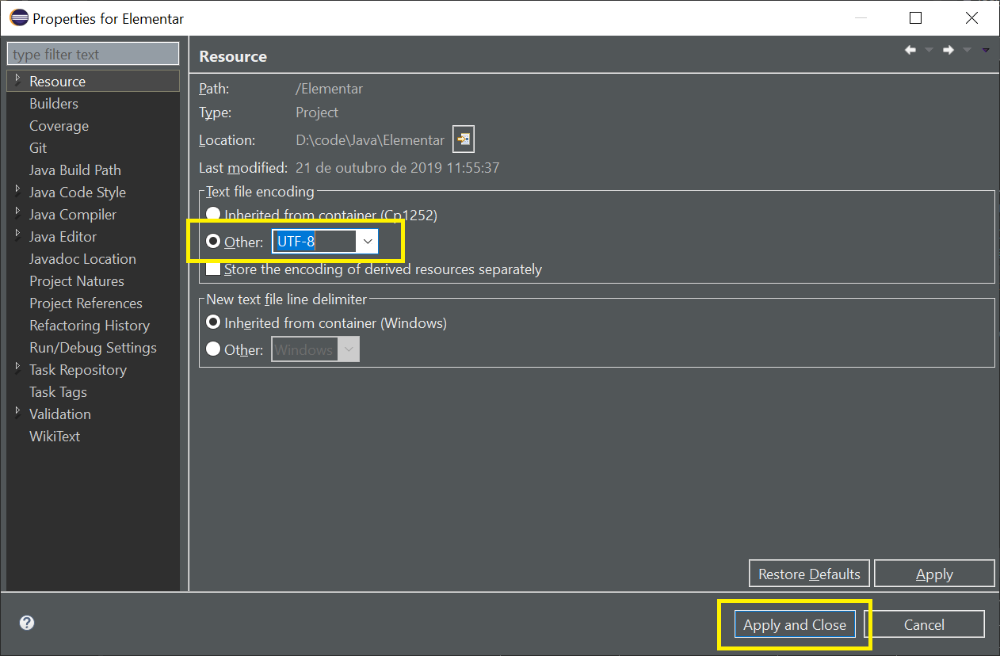
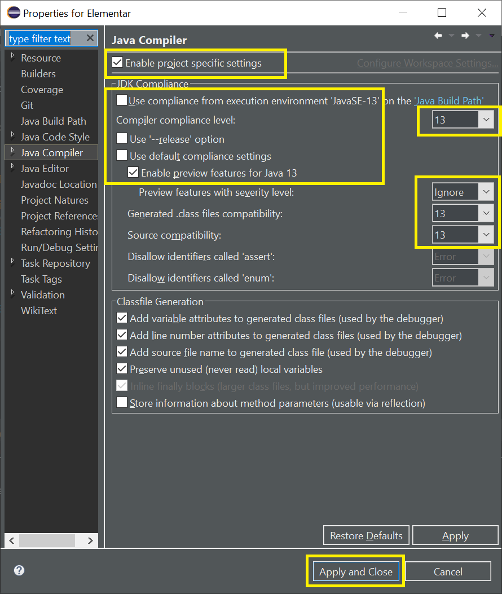
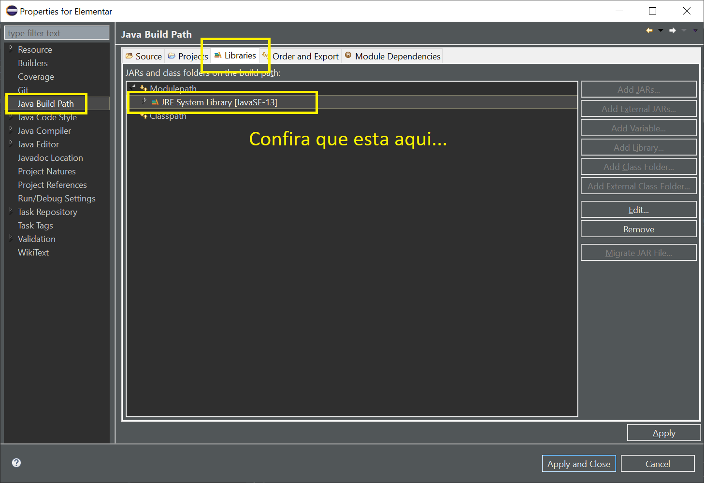
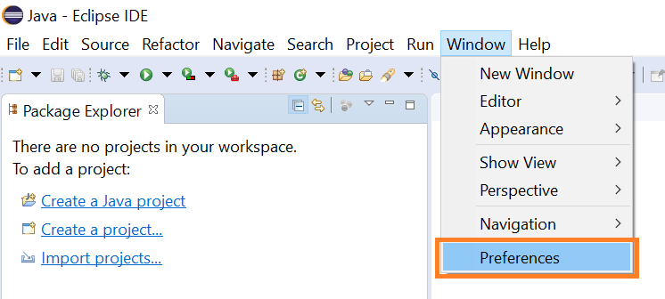
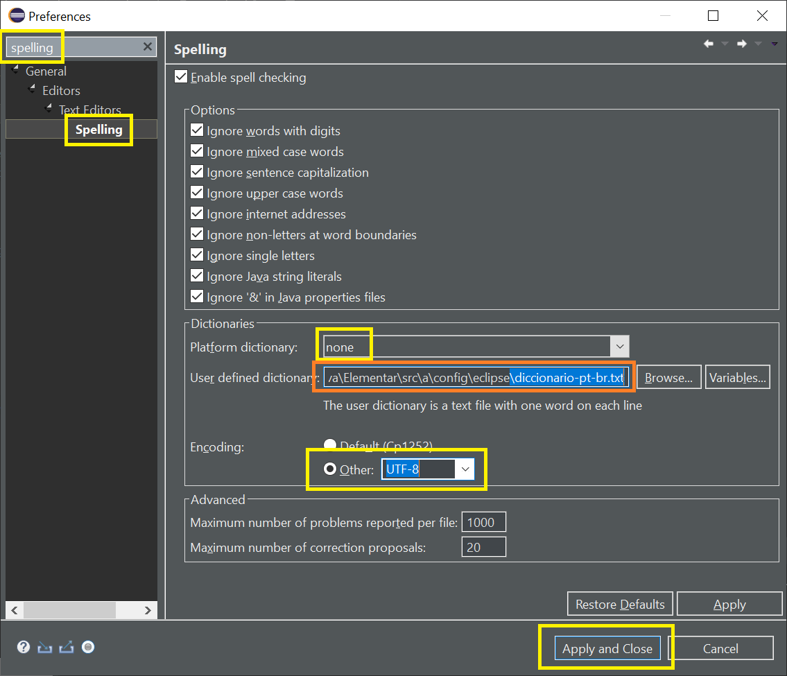

# Configurando o Eclipse 2019-09

* ***```Escolha```*** 


* ***```Configure no eclipse o OpenJDK13```***


* ***```No Projeto, Properties```***





* ***```Mude o Encoding```***


Estes progetos são todos codificados com o encoding mais comum e abrangente UTF-8




 
* ***```Java Compiler```***


Escolha a versão de seu java de compilação (no caso destes projetos preferi a versão 13)

no curso do Alex ele aconselha que você use o jdk 8 (você pode configurar isso aqui...)




 
* ***```Java Build Path```***


E bom dar uma conferidinha no Java Build Path para ver se a livraria esta ok




 
* ***```Acesse escolha novamente```***




 
* ***```Revisão Ortografica```***


Adicione o diccionario em Português do Brasil para que o eclipse corrija as palabras.





