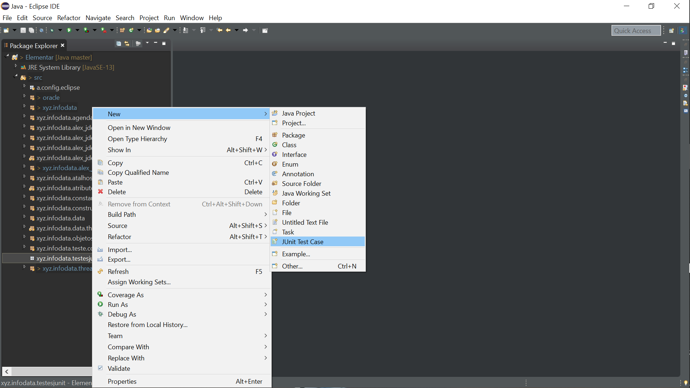
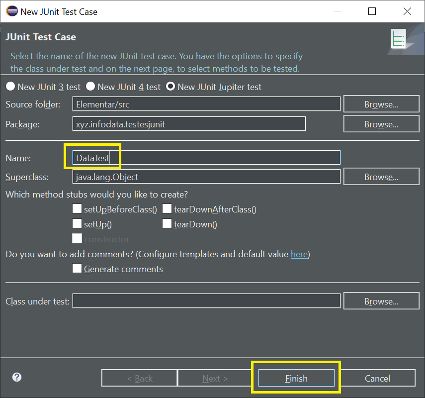
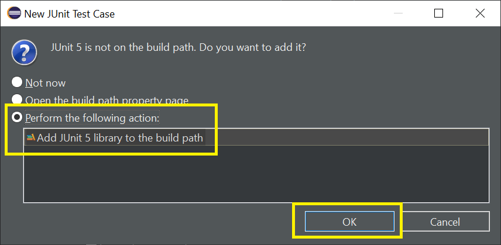
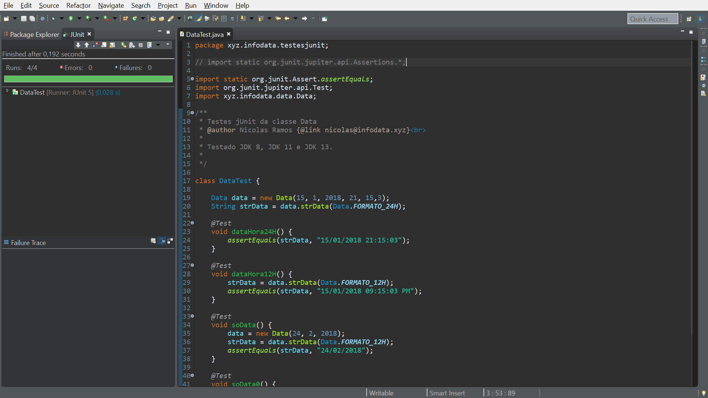

#### [DataTest](https://github1s.com/NicolasMCP/Java/blob/master/Elementar/src/xyz/infodata/testesjunit/DataTest.java) (interface vcode)


#### [MathTest](https://github1s.com/NicolasMCP/Java/blob/master/Elementar/src/xyz/infodata/testesjunit/MathTest.java) (interface vcode)


# Configurando JUnit Jupiter

* ***```Criando a Classe de teste```*** 


Clique no package onde colocará o teste, e com botão direito do
mouse va em New e depois em JUnit Test Case.





* ***```Configure```***


Informe o nome do teste JUnit em name.
Depois clique em Finish.





* ***```Configurando a primeira vez```***


Somente a primeira vez será necessário fazer esta configuração,
porque o eclipse esta baixando as librarias necessárias do 
JUnit, nas outras vezes só vão aparecer as primeiras 2 telas
de configuração.





* ***```Exemplo de uso```***


Veja um exemplo de como vai funcionar os testes, a barra verde
indica que os testes deram certo, se ficar vermelha, é porque
tem erros para corrigir.



